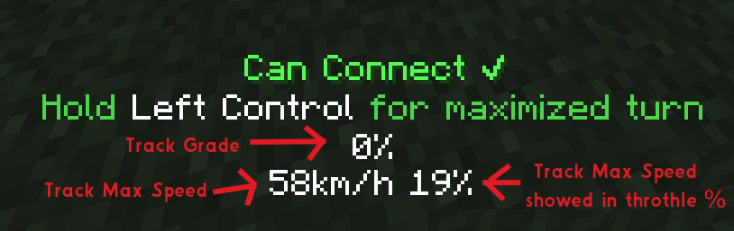

# Create Realism

## A Create addon that adds a bunch of features to make Create trains more realistic.

### Features:

#### -Changes the acceleration of trains to be dependent on the amount of cars attached to the train.

The more cars you have, the slower the train will accelerate.
The more locomotives(cars with conductors) you have, the less the acceleration will be affected.

#### - Track speed and grade overview

While building train tracks you can now see the max speed and grade of the track you are building. This also includes
the max speed as seen in train schedules, In (%). I recommend using [Create Tramways](https://modrinth.com/mod/tramways)
to temporarily set the max speed for curves and slopes

More features coming soon!..